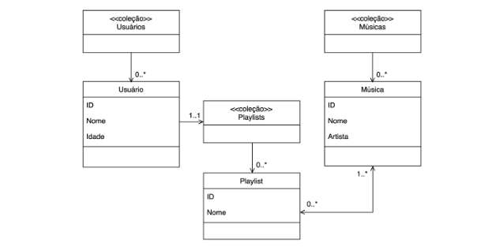
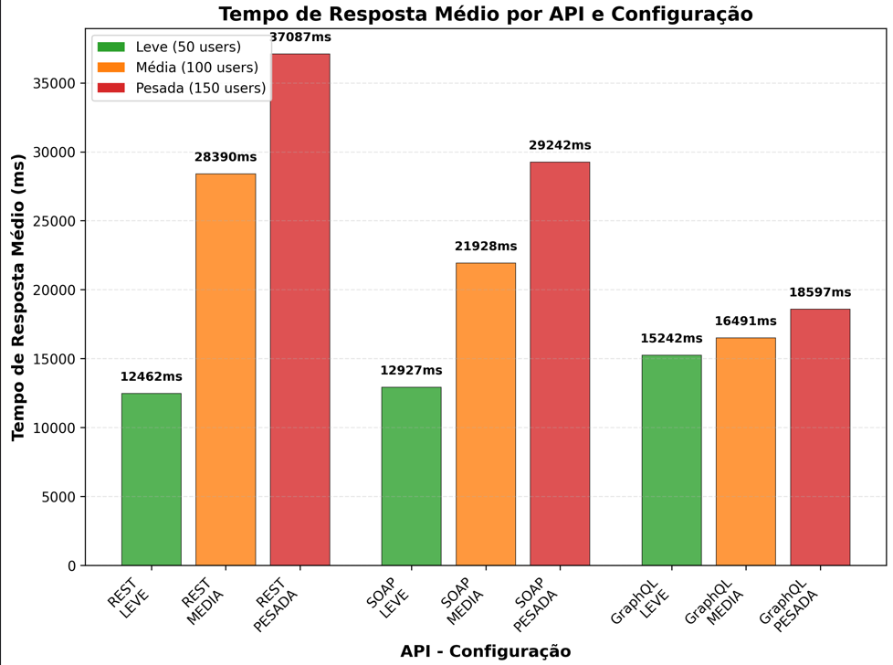
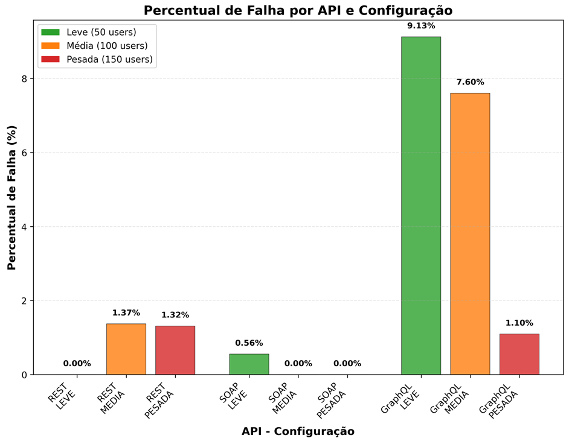
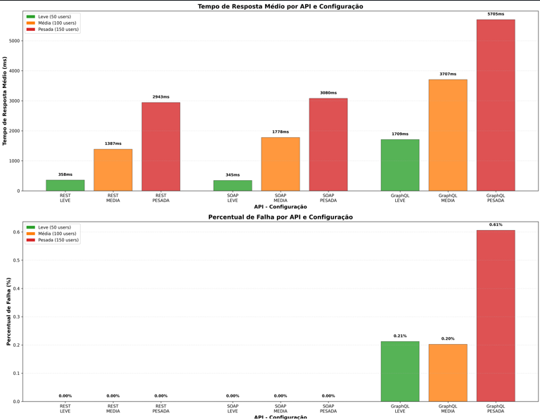

# CompDistProjeto6

Equipe:

- Caio Cesar da Silva Martins
- Vinicius Dantheias Barroso

Este projeto implementa e compara três tecnologias amplamente utilizadas para invocação de serviços remotos SOAP, REST e GraphQL, cada tecnologia foi implementada em duas linguagens diferentes:

- Python

- JavaScript (Node.js + Express)

Os serviços acessam um banco de dados que simula um sistema de streaming de música, contendo entidades de músicas, usuários e playlists,
as APIs foram submetidas a testes de carga e estresse utilizando Locust, analisando:

- Tempo médio de resposta

- Porcentagem de falhas

Comportamento sob diferentes quantidades de usuários simultâneos

- 50 usuários (leve)

- 100 usuários (médio)

- 150 usuários (pesado)

🏗 Arquitetura do Banco de Dados (Streaming Simulado)

Banco local Postgree

🌐 Descrição das APIs Implementadas

Cada API contém os mesmos três endpoints (ou equivalentes):

1. listarMusicas
2. listarUsuarios
3. listarPlaylists

Cada um usado com o mesmo peso nos testes do Locust.

📤 Exemplos das Respostas dos Endpoints

A seguir, uma base para incluir os outputs fornecidos.

REST — Exemplo da resposta de GET /musicas

[

  {
  
    "id": "550e8400-e29b-41d4-a716-446655440000",
    
    "nome": "Bohemian Rhapsody",
    
    "artista": "Queen"
    
  },
  
  {
  
    "id": "550e8400-e29b-41d4-a716-446655440001",''

SOAP — Exemplo da resposta de listarMusicas

{

  "musicas": [
  
    {
      "musica": {
        "id": "550e8400-e29b-41d4-a716-446655440000",
        "nome": "Bohemian Rhapsody",
        "artista": "Queen"
      }
    },
    {
      "musica": {

GraphQL — Exemplo da resposta

{

  "data": {
  
    "musicas": [
      {
        "id": "550e8400-e29b-41d4-a716-446655440000",
        "nome": "Bohemian Rhapsody",
        "artista": "Queen"
      },
      {
        "id": "550e8400-e29b-41d4-a716-446655440001",

🧪 Estrutura dos Testes de Desempenho (Locust)

Os testes no Locust eram compostos de três chamadas com pesos iguais:

- listarMusicas

- listarUsuarios

- listarPlaylists

E foram executados com três configurações de usuários simultâneos:

Cenário	Usuários	Descrição
- Leve	50	Carga pequena
- Médio	100	Carga moderada
- Pesado	150	Estresse máximo

<h2>Gráficos python:<h2>

<h2>Gráficos javacript:<h2>

📊 Resultados Comparativos

No geral, Python mostrou desempenho inferior para implementação de APIs, apresentando tempos de resposta bem maiores que JavaScript. Isso ocorre porque o modelo de concorrência do Python é menos eficiente que o event loop do Node.js.

Entre as APIs em Python, o REST foi o mais rápido em carga moderada, mas seu tempo de resposta cresceu bastante conforme o estresse aumentava. O GraphQL manteve tempos mais estáveis, porém foi a tecnologia com maior taxa de falhas — quanto maior a carga, mais erros surgiam e menos confiáveis se tornavam os dados retornados.

Nas APIs em JavaScript, o GraphQL dessa vez apresentou pior desempenho e mais erros. Já REST e SOAP tiveram resultados bem parecidos, com tempos de resposta muito melhores que os do Python. Isso reforça o quanto o ambiente Node.js lida melhor com alta concorrência do que as implementações em Python.
